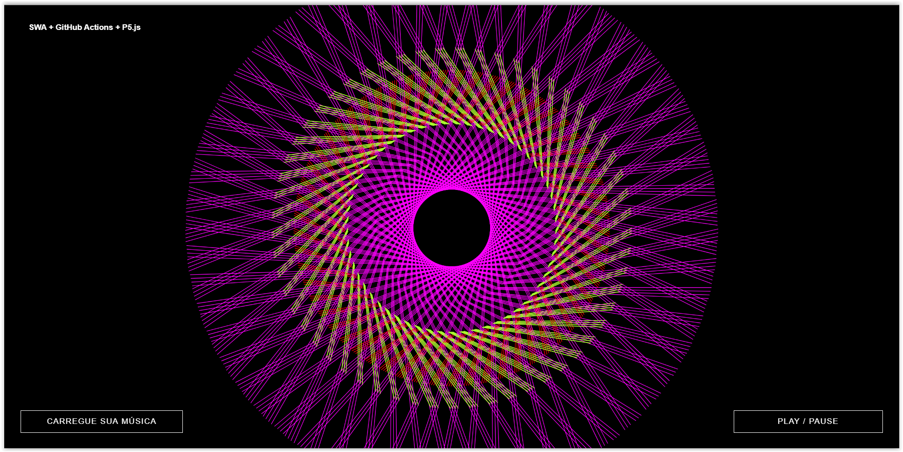

# 🎵 Music Player with P5.js + SWA + GitHub Actions

<p align="center">
  
</p>

Music Player in JavaScript using the **[p5.js](https://p5js.org/examples/)** library. The project is based on the following article **[HERE](https://tympanus.net/codrops/2018/03/06/creative-audio-visualizers/)**

The intention of this demo is not to teach about p5.js, but rather to show everyone how easy it is to deploy static applications using the Azure Static Web Apps service and how we can easily integrate with GitHub Actions!

If you want to know a bit more about the p5.js library, I will be providing links and necessary resources about the library here in the README.md

## 🚀 Resources Used

- **[Visual Studio Code](https://code.visualstudio.com/?WT.mc_id=javascript-0000-gllemos)**
- **[JavaScript library - P5.js](https://p5js.org/examples/)**
- **[Azure Static Web Apps](https://docs.microsoft.com/azure/static-web-apps/?WT.mc_id=javascript-0000-gllemos)**
- **[VS Code Extension - Azure Static Web Apps](https://marketplace.visualstudio.com/items?itemName=ms-azuretools.vscode-azurestaticwebapps&WT.mc_id=javascript-0000-gllemos)**
- **[GitHub Actions](https://docs.github.com/en/actions)**
- **[Free Azure Account](https://azure.microsoft.com/free/?WT.mc_id=javascript-0000-gllemos)**

## ⭐️ Account - Azure For Students

If you are a student at a College or University Educational Institution, you can create your account on **[Azure for Students](https://azure.microsoft.com/free/students/?WT.mc_id=javascript-0000-gllemos)**. This account will give you the benefit of having USD 100.00 credit to use the services for free, without needing a credit card. To activate this account, just access the link next to it: **[HERE](https://azure.microsoft.com/free/students/?WT.mc_id=javascript-0000-gllemos)**

## 🔥 Running the Application Locally

Before starting the steps below, it is very important that you run MongoDB locally at this moment!

1) Install the packages with the command: (inside the `src` folder)

```
> npm install
```

2) Then run the following command to run the application (inside the `src` folder):

```
> npm run start
```

Then just open Postman at **localhost:8000** and test the requests

And voilà! :heart: :heart:

## 🐳 Running with Docker

If you prefer to run the application using Docker:

1. Build the Docker image:

```
docker build -t music-player-swa .
```

2. Run the container:

```
docker run -p 8000:8000 music-player-swa
```

The application will be available at **localhost:8000**.

## 🔄 GitLab CI/CD Pipeline

This project includes a GitLab CI/CD pipeline for automated building and deployment.

### Connecting GitHub to GitLab

1. Create a new project in GitLab.
2. Choose "Import project" > "Repository by URL".
3. Enter the GitHub repository URL: `https://github.com/Aaskritembed/music-player-swa.git`
4. Follow the prompts to import the repository.

### CI/CD Pipeline

The `.gitlab-ci.yml` file defines the pipeline with the following stages:

- **Lint**: Runs ESLint to check code quality.
- **Build**: Builds the Docker image and pushes it to the GitLab Container Registry.
- **Deploy**: Pulls the image and runs the container in the production environment.

The pipeline triggers on pushes to the `main` branch.

## ❗️ Important Resources and Links

- ✅ **[Official Azure Static Web Apps Documentation](https://docs.microsoft.com/azure/static-web-apps/?WT.mc_id=javascript-0000-gllemos)**
- ✅ **[Microsoft Learn Course - Publishing a JavaScript application and API from Angular, React, Svelte or Vue with Azure Static Web Apps](https://docs.microsoft.com/learn/modules/publish-app-service-static-web-app-api/?WT.mc_id=javascript-0000-gllemos)**
- ✅ **[Microsoft Learn Course - Creating and publishing a static web application with Gatsby and Azure Static Web Apps](https://docs.microsoft.com/learn/modules/create-deploy-static-webapp-gatsby-app-service/?WT.mc_id=javascript-0000-gllemos)**
- ✅ **[Microsoft Learn Course - Building continuous integration (CI) workflows with GitHub Actions](https://docs.microsoft.com/learn/modules/github-actions-ci/?WT.mc_id=javascript-0000-gllemos)**
- ✅ **[Official P5.sound Documentation](https://p5js.org/reference/#/libraries/p5.sound)**
- ✅ **[Article based on the demo](https://tympanus.net/codrops/2018/03/06/creative-audio-visualizers/)**

## ❓ I Have Questions... What Do I Do?!

If you have questions about the codes developed during the series of articles, feel free to open an **[ISSUE HERE](https://github.com/glaucia86/music-player-swa/issues)**. As soon as possible, I will be answering all the questions you have!
